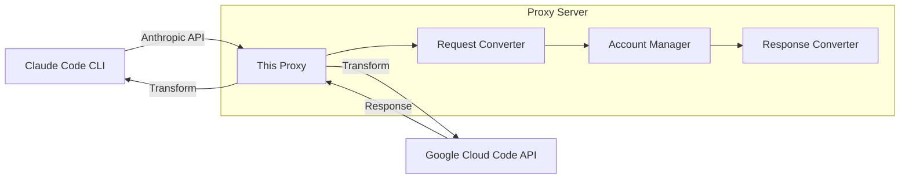

# Antigravity Claude Proxy

A proxy server exposing an **Anthropic-compatible API** backed by **Google Cloud Code** (Antigravity). Use Claude and Gemini models with Claude Code CLI.

## Quick Start

```bash
# 1. Install
npm install -g antigravity-claude-proxy

# 2. Add an account (opens browser for OAuth)
antigravity-claude-proxy accounts add

# 3. Start the proxy
antigravity-claude-proxy start
```

Configure Claude Code (`~/.claude/settings.json`):

```json
{
  "env": {
    "ANTHROPIC_BASE_URL": "http://localhost:8080",
    "ANTHROPIC_API_KEY": "dummy"
  }
}
```

Run Claude Code:

```bash
claude
```

## Architecture



### Request Flow

1. **Receive** Anthropic Messages API request
2. **Authenticate** using OAuth tokens from added accounts
3. **Transform** request to Google Generative AI format
4. **Send** to Cloud Code API (`cloudcode-pa.googleapis.com`)
5. **Transform** response back to Anthropic format
6. **Return** with full thinking/streaming support

## CLI Reference

| Command                        | Description                               |
| ------------------------------ | ----------------------------------------- |
| `start`                        | Start proxy server                        |
| `start --port 3000`            | Custom port (default: 8080)               |
| `start --fallback`             | Enable model fallback on quota exhaustion |
| `start --debug`                | Verbose logging                           |
| `init`                         | Interactive setup wizard                  |
| `accounts add`                 | Add account via OAuth                     |
| `accounts add --no-browser`    | Headless OAuth (manual URL)               |
| `accounts add --refresh-token` | Use refresh token directly                |
| `accounts list`                | List all accounts                         |
| `accounts verify`              | Verify account tokens                     |
| `accounts remove`              | Remove accounts interactively             |
| `accounts clear`               | Remove all accounts                       |

### Logging Options

```bash
antigravity-claude-proxy start \
  --log-level debug \    # silent|error|warn|info|debug|trace
  --log-file proxy.log \ # Log to file
  --json-logs \          # JSON output for parsing
  --silent               # Suppress output except errors
```

## Models

### Claude Models

| Model ID                     | Description                              |
| ---------------------------- | ---------------------------------------- |
| `claude-sonnet-4-5-thinking` | Claude Sonnet 4.5 with extended thinking |
| `claude-opus-4-5-thinking`   | Claude Opus 4.5 with extended thinking   |
| `claude-sonnet-4-5`          | Claude Sonnet 4.5 (no thinking)          |

### Gemini Models

| Model ID            | Description                  |
| ------------------- | ---------------------------- |
| `gemini-3-flash`    | Gemini 3 Flash with thinking |
| `gemini-3-pro-low`  | Gemini 3 Pro Low             |
| `gemini-3-pro-high` | Gemini 3 Pro High            |

## Multi-Account Load Balancing

When multiple accounts are added:

- **Sticky sessions** - Stays on same account for prompt cache hits
- **Smart failover** - Short rate limits (<=2min): wait. Longer: switch accounts
- **Auto-recovery** - Rate-limited accounts rejoin after reset
- **Invalid detection** - Bad tokens are marked and skipped

Check status:

```bash
curl "http://localhost:8080/account-limits?format=table"
```

## API Endpoints

| Endpoint          | Method | Description               |
| ----------------- | ------ | ------------------------- |
| `/v1/messages`    | POST   | Anthropic Messages API    |
| `/v1/models`      | GET    | List available models     |
| `/health`         | GET    | Health check              |
| `/account-limits` | GET    | Account status and quotas |
| `/refresh-token`  | POST   | Force token refresh       |

## How This Fork Differs

This is a TypeScript rewrite of the [original proxy](https://github.com/badri-s2001/antigravity-claude-proxy) with significant improvements:

### Code Quality

| Aspect      | Original   | This Fork                       |
| ----------- | ---------- | ------------------------------- |
| Language    | JavaScript | TypeScript                      |
| Tests       | None       | 1052 tests, 94%+ coverage       |
| Test Types  | -          | Unit, fuzz, contract, benchmark |
| Type Safety | None       | Full static typing              |

### Developer Experience

| Feature | Original       | This Fork                   |
| ------- | -------------- | --------------------------- |
| CLI     | Basic argparse | Commander + @clack/prompts  |
| Logging | Console.log    | Pino structured logging     |
| UI      | Plain text     | Colors, spinners, tables    |
| Setup   | Manual         | Interactive wizard (`init`) |

### Reliability

- **Fuzz testing** - Property-based tests for edge cases
- **Contract tests** - API schema validation
- **Benchmark suite** - Performance regression detection
- **Pre-commit hooks** - Gitleaks secret scanning

### Core Functionality Preserved

All original features remain fully compatible:

- Anthropic Messages API format
- Streaming with SSE
- Extended thinking blocks
- Multi-account rotation
- Rate limit handling
- OAuth authentication
- Model fallback

## Development

```bash
# Clone and install
git clone https://github.com/NikkeTryHard/antigravity-claude-proxy.git
cd antigravity-claude-proxy
npm install

# Development
npm run dev              # File watching
npm run typecheck        # Type checking
npm run lint             # ESLint

# Testing
npm test                 # Unit tests
npm run test:coverage    # With coverage
npm run test:bench       # Benchmarks
npm run test:integration # Integration (server must be running)
```

## Troubleshooting

### "Could not extract token"

Add accounts via OAuth: `antigravity-claude-proxy accounts add`

### 401 Authentication Errors

```bash
curl -X POST http://localhost:8080/refresh-token
```

Or re-authenticate: `antigravity-claude-proxy accounts`

### Rate Limiting (429)

With multiple accounts, the proxy auto-switches. Single account must wait for reset.

## Legal

Not affiliated with Google or Anthropic. Use at your own risk. See [LICENSE](LICENSE) for details.

---

MIT License
